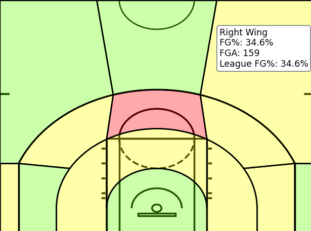

# NBA Shot Chart Heat Map

An interactive NBA shot chart that visualizes a player's shooting efficiency by zone compared to league average.

## How It Works

Shot data is pulled from the NBA API using `ShotChartDetail`, which provides the x/y coordinates and outcome of every field goal attempt for a given player and season. A half-court diagram is drawn from scratch using matplotlib, with 14 custom shooting zones defined as geometric polygons. Each shot coordinate is spatially mapped to a zone using matplotlib's `Path.contains_points()` method.

Zone-level shooting percentages are calculated and compared against league averages from `ShotChartLeagueWide`. For zones that don't map cleanly to a single NBA category (such as the restricted area and middle close zone), FGM and FGA are summed across the relevant rows before calculating a weighted average. Heat classification uses a binomial standard deviation model scaled to the player's shot volume in each zone, so zones with small sample sizes require a larger deviation from league average to be classified as hot or cold.

## Example: Anthony Edwards Heat Map

<div align="center">
    
</div>


## Running the Tool

```bash
python heat_map.py
```

To change the player or season, update the arguments in `calculations.py`:

```python
shot_data = player_shot_data('Player Name', '2024-25')
```

## Installation

1. Clone this repository
2. Create a virtual environment:
   ```bash
   python -m venv .venv
   ```
3. Activate it:
   - **Windows:** `.venv\Scripts\activate`
   - **macOS/Linux:** `source .venv/bin/activate`
4. Install dependencies:
   ```bash
   pip install -r requirements.txt
   ```

## Known Limitations

- Player selection is currently hardcoded in `calculations.py`
- Zone boundaries are custom-defined and approximate the NBA's official zone classifications
- Zones with very low shot volume (< 5 attempts) may produce unreliable heat classifications
